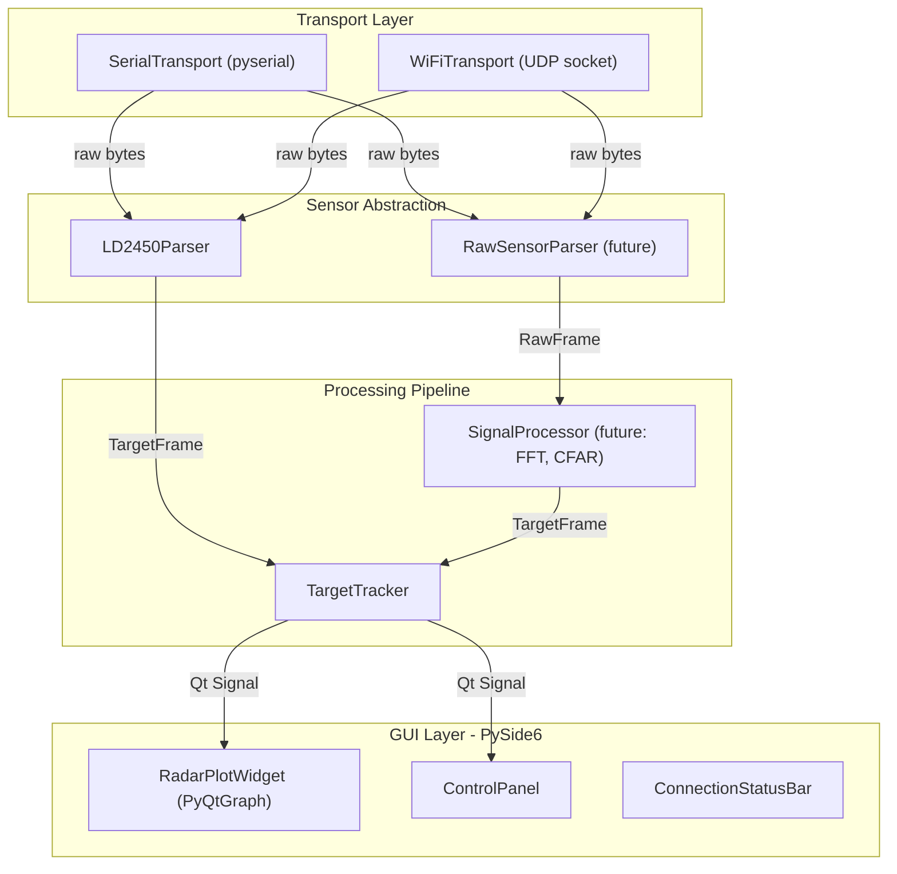

# mmDetect Host Application

## Architecture Overview

The app follows a layered, plugin-style architecture so that swapping transport (serial vs WiFi) or sensor (LD2450 vs TI IWR) doesn't require rewriting the GUI or data pipeline.




## Tech Stack

- **GUI**: PySide6 (Qt6) -- LGPL licensed, official Qt binding
- **Real-time plotting**: PyQtGraph -- GPU-accelerated, NumPy-native
- **Serial**: pyserial (threaded reader)
- **WiFi**: Python `socket` module (UDP)
- **Data**: NumPy, dataclasses
- **Future signal processing**: SciPy (FFT, filtering, CFAR)

## Project Structure

All host code lives in `mmDetect_app/`:

```
mmDetect_app/
  requirements.txt
  README.md
  mmdetect/
    __init__.py
    main.py                  # Entry point, QApplication setup
    models/
      __init__.py
      target.py              # TargetFrame, Target dataclasses
    transport/
      __init__.py
      base.py                # AbstractTransport (ABC)
      serial_transport.py    # pyserial in QThread
      wifi_transport.py      # UDP socket in QThread
    parsers/
      __init__.py
      base.py                # AbstractParser (ABC)
      ld2450_parser.py       # 30-byte frame parser (mirrors firmware logic)
    processing/
      __init__.py
      tracker.py             # Target history, smoothing, trail buffer
      signal_processor.py    # Stub for future raw-data DSP
    gui/
      __init__.py
      main_window.py         # QMainWindow, layout, menus
      radar_widget.py        # PyQtGraph polar/cartesian plot
      control_panel.py       # Transport selector, connect/disconnect, config
      status_bar.py          # Connection state, FPS, target count
```

## Key Design Decisions

### 1. Transport Layer (serial + WiFi)

Both transports inherit from `AbstractTransport` and run in a `QThread`. They emit a Qt signal (`bytes_received = Signal(bytes)`) when data arrives. The GUI picks which transport via a dropdown -- no code changes needed to switch.

- **Serial**: pyserial at 115200 baud (ESP32 USB-UART bridge on UART0). The ESP32 firmware needs a small change: forward parsed `ld2450_frame_t` data out UART0 in a simple binary protocol (header + 3 targets + checksum).
- **WiFi (UDP)**: ESP32 sends UDP packets to the host on a known port. Lower priority but same frame format. Firmware needs WiFi init + UDP send after frame parse.

### 2. Parser Layer

`LD2450Parser` takes raw bytes from transport, buffers them, finds frame boundaries (header/tail), and emits `TargetFrame` objects. This mirrors your firmware's `ld2450_parse_frame` logic.

For a future raw-data sensor, a `RawSensorParser` would emit `RawFrame` objects (ADC samples) that feed into `SignalProcessor` instead.

### 3. Radar Visualization

PyQtGraph `PlotWidget` with:

- Top-down 2D scatter plot (X vs Y in mm)
- Color-coded targets (up to 3)
- Trail/history lines showing target paths
- Optional velocity vectors
- Configurable detection zone overlay
- QTimer at ~30 FPS polls the latest frame data and updates the plot

### 4. Firmware Changes Required

The ESP32 currently only logs targets via `ESP_LOGI`. Two additions are needed:

**a) Serial forwarding (UART0):** After parsing a valid frame in `ld2450_task`, serialize the `ld2450_frame_t` and write it to UART0 (the USB-serial bridge) using a simple framed protocol:

```c
// Example: [0xBB][0xBB][target_count][target0...targetN][checksum][0xEE][0xEE]
```

**b) WiFi UDP forwarding:** Complete `mm_wifi_init()`, connect to AP, and after each valid frame, send a UDP packet with the same serialized format to a configured host IP:port.

### 5. Extensibility for Raw Sensors

The `processing/signal_processor.py` module is a stub initially. When a TI IWR sensor is added:

- Add a `RawSensorParser` in `parsers/`
- Implement range-FFT, Doppler-FFT, CFAR detection in `signal_processor.py` using NumPy/SciPy
- Output `TargetFrame` objects so the same GUI visualization works unchanged

## Firmware-to-Host Protocol

A lightweight binary protocol for both serial and UDP:


| Field | Size | Description |
| ----- | ---- | ----------- |


- Header: 2 bytes (`0xBB 0xBB`)
- Frame ID: 4 bytes (uint32, monotonic counter)
- Timestamp: 4 bytes (uint32, ms since boot)
- Target count: 1 byte (0-3)
- Per target (x 3): 8 bytes each (x_mm: i16, y_mm: i16, speed_cms: i16, resolution_mm: u16) -- all little-endian
- Checksum: 1 byte (XOR of all payload bytes)
- Tail: 2 bytes (`0xEE 0xEE`)

Total: 2 + 4 + 4 + 1 + 24 + 1 + 2 = 38 bytes per frame

## Steps

### Phase 1: Foundation (host app skeleton + serial transport)

1. Set up `mmDetect_app/` project structure, `requirements.txt`, virtual environment
2. Implement `models/target.py` dataclasses
3. Implement `AbstractTransport` and `SerialTransport` (QThread + pyserial)
4. Implement `LD2450Parser` (frame sync, parse, emit `TargetFrame`)
5. Build basic `MainWindow` with PyQtGraph radar plot
6. Wire transport -> parser -> GUI with Qt signals
7. Firmware: add UART0 forwarding of parsed frames from `ld2450_task`

### Phase 2: WiFi transport + polish

1. Firmware: complete `mm_wifi_init()` + UDP sender
2. Implement `WiFiTransport` (UDP listener in QThread)
3. Add `ControlPanel` with transport selector, connect/disconnect, serial port picker
4. Add `StatusBar` with connection state, FPS counter, target count

### Phase 3: Visualization enhancements

1. Target trails / history paths
2. Velocity vectors
3. Detection zone overlay (configurable)
4. Data recording / playback (CSV or binary log)

### Phase 4: Signal processing extensibility

1. Stub out `SignalProcessor` with NumPy/SciPy pipeline interface
2. Add `RawSensorParser` base class for future TI IWR integration

